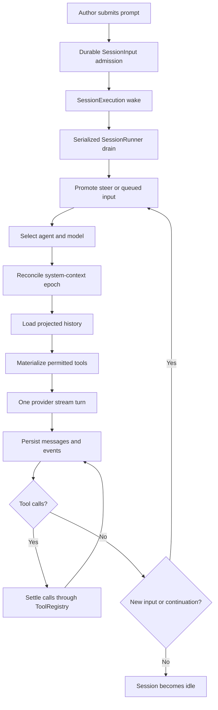
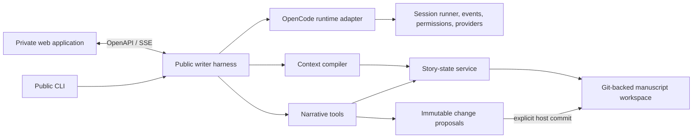

# From Coding Agent to Novel-Writing Harness

Status: research proposal; no implementation is authorized by this document.

This report defines what a strong novel-writing harness must do, audits whether OpenCode can provide the underlying agent runtime, compares implementation strategies, and specifies the experiments that should precede production code.

## Executive conclusion

We should not begin by converting every coding concept in OpenCode into a writing equivalent. OpenCode's current V2 core already contains a largely domain-neutral agent runtime: durable prompts, resumable sessions, model routing, tool execution, permissions, event streaming, snapshots, and an embedded SDK. The writing-specific product should sit above that runtime.

The recommended direction is a **thin, public writer runtime built on OpenCode**, with a deliberately small compatibility patch surface:

1. Start with a stock-OpenCode experiment using writer agents, instructions, and MCP tools. This validates the writer workflow and tool vocabulary before we fork core behavior.
2. Build an embedded writer application around `sdk-next`, registering first-class narrative tools through `ApplicationTools` and keeping OpenCode's session runner unchanged.
3. Maintain story state in a writer-owned domain service. Treat the manuscript as source text and the story model as derived, reviewable state—not as the model's private memory.
4. Require Git-backed novel workspaces in the first version so OpenCode snapshots and reverts remain useful and project identity stays stable.
5. Patch or upstream only the extension seams that experiments prove necessary. The two known candidates are custom system-context sources and task-specific compaction.

The original broad "domain profile" proposal is therefore too invasive. We should preserve the existing draft implementation as a hypothesis, not merge it, and replace its next core-profile work with the experiments in this report.

## 1. What a novel-writing harness is

A model, a chat window, and a manuscript-sized prompt are not a harness. A harness is the control system around one or more models. It translates an author's request into bounded work, selects relevant evidence, exposes safe actions, keeps durable state, makes proposed changes inspectable, and measures whether the result honored the author's intent.

For novel work, the harness has three simultaneous responsibilities:

- **Creative collaborator:** explore possibilities without collapsing ambiguity or making subjective choices look objectively required.
- **Narrative reasoner:** track facts, time, causality, character knowledge, promises, arcs, viewpoint, and voice across a long manuscript.
- **Change-control system:** separate reading, diagnosis, proposal, and commit; preserve provenance; and make every mutation reversible.

This framing matters because long-form narrative is not merely a larger code context. Code usually has machine-checkable semantics and a relatively crisp notion of correctness. Fiction can contain unreliable narration, deliberate contradictions, nonlinear chronology, withheld information, idiolect, and intentional rule-breaking. A writing harness must distinguish accidental inconsistency from artistic intention.

## 2. Primary jobs to be done

The harness should support these jobs independently. Combining them too early makes evaluation vague and permissions unsafe.

| Job | Typical request | Required output | Default authority |
| --- | --- | --- | --- |
| Explain | "What does Mara know when chapter 12 begins?" | Answer with passage evidence and uncertainty | Read only |
| Diagnose | "Find continuity problems in this sequence" | Ranked findings with evidence, impact, and confidence | Read only |
| Brainstorm | "Give me five ways this betrayal could land harder" | Distinct alternatives and tradeoffs | Read only |
| Plan | "Rework the midpoint without changing the ending" | Proposed beats, dependencies, and preserved constraints | Read only |
| Revise | "Make this argument tenser but keep Eli sympathetic" | Scoped prose diff plus rationale | Propose only |
| Refactor | "Move the reveal three chapters earlier" | Multi-scene change set and story-state consequences | Propose only |
| Synchronize | "Update the character and timeline records" | Proposed structured-state changes with evidence | Propose only |
| Translate | "Translate this chapter while preserving voice" | Parallel text, glossary decisions, and flagged ambiguities | Propose only; later milestone |

The first product slice should implement Explain, Diagnose, Plan, and scoped Revise. Multi-chapter refactors and translation should wait until proposal validation and story-state synchronization are trustworthy.

## 3. Quality bar

### 3.1 Faithfulness to author intent

Every substantive task should compile the request into a visible working contract:

- **Goal:** what outcome the author wants.
- **Scope:** which passages or story entities may change.
- **Preserve:** facts, beats, voice features, subtext, or wording that must remain.
- **Freedom:** where invention is welcome.
- **Authority:** analyze, comment, propose, or commit.
- **Success checks:** concrete conditions used to review the result.

The harness should ask a question only when different reasonable answers would materially alter the result. Otherwise it should state a reversible assumption and proceed.

### 3.2 Narrative understanding

The working story model needs more than characters and a synopsis. At minimum it must represent:

- manuscript hierarchy: book, part, chapter, scene, paragraph, passage;
- entities and aliases;
- asserted facts and world rules;
- event order, story time, duration, and uncertainty;
- where characters are and what each character knows or believes;
- causal and emotional state transitions;
- viewpoint, tense, distance, and voice observations;
- arcs, promises, setups, payoffs, and unresolved threads;
- evidence spans and confidence for every derived claim.

Research on long-story consistency reports that errors cluster around factual and temporal continuity and can appear far from the point where a fact was introduced. This supports a temporal/relational story model in addition to semantic retrieval, rather than relying on a single vector index ([ConStory-Bench](https://arxiv.org/abs/2603.05890)). Dynamic hierarchical outlining and temporal knowledge-graph memory are also active approaches in long-form generation research ([DOME](https://arxiv.org/abs/2412.13575)).

### 3.3 Evidence-grounded reasoning

The harness must separate:

- **observation:** directly supported by manuscript passages;
- **inference:** a plausible reading of those passages;
- **suggestion:** an artistic option, not a discovered fact.

Story facts, diagnoses, and proposed state changes should cite precise manuscript spans. Unsupported certainty is a failure even when the prose sounds convincing.

### 3.4 Author agency

The default mutation boundary is:

```text
inspect -> diagnose -> plan -> propose diff -> author reviews -> commit -> refresh story state
```

The model may not silently change canon. Analysis, alternatives, and proposals are safe model actions. Commit is an explicit author or host-application action. Research into human-AI co-creation suggests that reducing a writer to a mere editor can reduce perceived creativity, so the interface and runtime should preserve meaningful choice rather than optimize only for automatic text production ([Scientific Reports](https://www.nature.com/articles/s41598-024-69423-2)).

### 3.5 Creative competence

A continuity checker that flattens voice and removes productive ambiguity is not a good writing partner. The harness should:

- preserve intentional ambiguity and unreliable narration;
- offer meaningfully different alternatives when the choice is subjective;
- describe voice using evidence rather than imitating a named living author;
- explain the dramatic tradeoff of a proposal;
- avoid treating genre conventions as rules;
- allow the writer to mark contradictions, omissions, and stylistic irregularities as intentional.

### 3.6 Context quality

Context should be compiled for the task, not dumped wholesale. A useful context compiler can combine:

1. exact scope and nearby prose;
2. manuscript hierarchy and scene metadata;
3. lexical and semantic retrieval;
4. entity, temporal, causal, and character-knowledge links;
5. relevant plans, style observations, and author decisions;
6. explicit exclusions and token-budget accounting.

Commercial writing tools already use a story bible and substantial preceding text as task context, but the harness needs inspectable retrieval and evidence because its work may span whole books ([Sudowrite Story Bible](https://docs.sudowrite.com/using-sudowrite/1ow1qkGqof9rtcyGnrWUBS/what-is-story-bible/jmWepHcQdJetNrE991fjJC), [Sudowrite Write](https://docs.sudowrite.com/using-sudowrite/1ow1qkGqof9rtcyGnrWUBS/write/pvxUvbQqYybfEosqx1sXjY)).

### 3.7 Reliability, reversibility, and provenance

The system needs durable sessions, deterministic proposal schemas, checkpoints, change sets, a record of accepted and rejected suggestions, and traces that explain which context and tools influenced an answer. Manuscript material and AI contributions should remain distinguishable. Provider behavior, retention, and training policies must be visible to the user; publishing-industry guidance also makes human authorship and disclosure important design considerations ([Authors Guild best practices](https://authorsguild.org/resource/ai-best-practices-for-authors/), [U.S. Copyright Office AI initiative](https://www.copyright.gov/ai/)).

## 4. OpenCode audit

Audit base: upstream `dev` at `34e58090595d44e3e7cc37498f16753a98627456`.

### 4.1 Runtime flow

The current V2 path is a durable orchestration loop, not merely a coding prompt:



This is the right underlying shape for a writer harness. Durable prompt admission is separated from execution; each provider turn reloads projected history; tool results and model output become persistent events; steering can arrive at safe boundaries; and different sessions may execute concurrently.

### 4.2 What is reusable without conceptual change

| Capability | OpenCode location | Writer use |
| --- | --- | --- |
| Durable prompt admission and resumable execution | `packages/core/src/session.ts`, `packages/core/src/session/input.ts`, `packages/core/src/session/runner/llm.ts` | Long-running analysis and revision tasks |
| Agent definitions and transforms | `packages/core/src/agent.ts`, `packages/core/src/plugin/agent.ts` | Replace coding agents with reader, editor, planner, continuity, and translator agents |
| Typed tools | `packages/core/src/tool/tool.ts` | Story lookup, evidence search, proposal construction, timeline queries |
| Process-level application tools | `packages/core/src/tool/application-tools.ts` | Register writer-native tools in an embedded application |
| Location-level tool overlay | `packages/core/src/tool/registry.ts` | Materialize tools per novel workspace and agent policy |
| Permission rules and durable approval requests | `packages/core/src/permission.ts` | Gate expensive, external, or mutating operations |
| Typed system context with snapshots | `packages/core/src/system-context/index.ts`, `packages/core/src/system-context/registry.ts` | Inject project brief, story-state revision, and active scope |
| Model/provider abstraction | core model and provider services | Let authors choose models and data policies |
| Event and message protocol | `packages/schema/src/session-message.ts`, server protocol/routes | Stream plans, evidence, proposals, and tool state to any UI |
| Git snapshots and reverts | `packages/core/src/snapshot.ts` | Reversible manuscript checkpoints |
| Embedded client/server composition | `packages/sdk-next/src/opencode.ts` | Build a writer CLI or service without adopting OpenCode's UI |

This agrees with the way mature agent SDKs describe their core responsibilities: a built-in tool loop, sessions, human-in-the-loop controls, and tracing are general infrastructure rather than domain logic ([OpenAI Agents SDK](https://openai.github.io/openai-agents-js/), [Claude Agent SDK loop](https://code.claude.com/docs/en/agent-sdk/agent-loop)). OpenCode's documented client/server architecture is also compatible with keeping a private web application separate from the public harness ([OpenCode server](https://opencode.ai/docs/server/)).

### 4.3 Coding assumptions that must change

| Assumption | Evidence | Decision |
| --- | --- | --- |
| Project instructions are `AGENTS.md` files | `packages/core/src/instruction-context.ts` | Support a writer project brief and structured sources; retain `AGENTS.md` only as a compatibility path initially |
| Built-in agent catalog is build/plan/general/explore | `packages/core/src/plugin/agent.ts` | Remove or override through existing agent transforms; no core profile abstraction required |
| Compaction summarizes files, symbols, and commands | `packages/core/src/session/compaction.ts` | Must become task-specific before long-book production use |
| Project identity assumes a Git repository | `packages/core/src/project.ts` | Require Git-backed novel workspaces for the MVP |
| Snapshots are Git trees and file diffs | `packages/core/src/snapshot.ts` | Reuse for manuscript files; add a writer-domain revision for non-file indexes/state |
| The bundled UI emphasizes files, terminals, and code diffs | `packages/app` | Out of scope for the public harness; the private web app consumes protocol/events |
| Some message shapes mention files, shells, and patches | `packages/schema/src/session-message.ts` | Leave compatible fields unused; carry writer proposals as structured tool output first |
| Tool authorization is implemented at tool leaves | `packages/core/src/tool/registry.ts`, `packages/core/src/permission.ts` | Make proposal tools nonmutating; keep commit outside the model tool loop |

### 4.4 Important limitations and risks

#### Compaction is currently coding-specific

The existing compaction prompt asks for relevant files, symbols, paths, and commands; older tool output is truncated. A novel session could therefore lose voice constraints, author decisions, unresolved ambiguity, or the provenance of a fact. Canon must never be reconstructed from a conversational summary. Until custom compaction exists, long-running writer sessions should either disable automatic compaction or restart from durable task/story state.

#### System-context extension is not yet a complete public seam

Core contains a strong typed context algebra with durable baseline/update/removal semantics. Built-ins currently cover environment/date and `AGENTS.md`-style instructions. Location service composition supports replacements, but the V2 plugin surface does not expose a simple public `context.register(...)` analogous to application tools. This is a credible minimal upstream patch candidate.

#### Plugin and application extension surfaces are asymmetrical

Plugins can transform agents, config, catalog, skills, and references. Embedded applications can register tools. A writer product that needs both writer-native tools and continuously refreshed story context is therefore cleaner as an embedded application than as a plugin alone.

#### Git is not optional in practice

Outside Git, snapshots are disabled and project identity may collapse toward a drive/root-level fallback. The MVP should initialize a private Git repository per novel workspace. This is an internal implementation detail; authors should not need Git knowledge.

#### Story state creates a dual-representation problem

Manuscript prose and derived structured state can disagree after a revision. We need an explicit invariant:

> Manuscript text and accepted author decisions are authoritative. Structured story state is evidence-linked, revisioned, and invalidated or refreshed after accepted text changes.

Putting all structured state in files would make Git atomicity easy but can be noisy and slow. A database is better for queries but requires a transaction/revision link to the manuscript snapshot. This needs an experiment, not an early irreversible choice.

#### Upstream V2 is still moving

The repository contains both legacy and V2 paths, and some V2 operations remain unavailable. A deep fork of `dev` would inherit substantial merge risk. Our public harness should pin a known revision, isolate adapters, and keep the core patch set small.

## 5. Architecture options

| Option | Description | Advantages | Problems | Verdict |
| --- | --- | --- | --- | --- |
| Deep fork | Rewrite OpenCode concepts and core packages around fiction | Maximum control | Large divergence, migration risk, duplicates generic runtime work | Reject |
| Plugin/MCP only | Stock OpenCode plus writer agents, instructions, skills, and an MCP server | Fastest experiment, near-zero core changes | Weak context integration, coding compaction, awkward domain approval/API boundaries | Use for Phase 0 |
| Embedded writer application | Public writer process embeds OpenCode, registers application tools, owns story service | Reuses durable loop; first-class tools; UI-independent | Needs adapter work and likely two small extension seams | Recommended target |
| Independent package on released OpenCode libraries | No fork; depend on stable packages | Lowest long-term maintenance | Current V2 APIs may not yet be stable/published for all needs | Long-term goal |
| New standalone harness | Rebuild sessions, events, tools, permissions, providers, and persistence | Complete independence | Recreates the hardest generic infrastructure before validating the writing model | Reject now |

### Recommended component boundary



The OpenCode adapter should be treated as replaceable infrastructure. Writer-domain contracts must not import OpenCode message types throughout the codebase. The writer harness owns task contracts, evidence references, story-state revisions, proposals, and commit receipts; the adapter maps those concepts to agents, tools, context, and session events.

## 6. Proposed writer loop

### 6.1 Task admission

The harness parses a prompt and current selection into a `WriterTask` proposal containing job, goal, scope, preserved constraints, creative freedom, authority, and success checks. For analysis-only requests this can be implicit but inspectable. Any request with broad or destructive consequences should require confirmation of the task contract before generation.

### 6.2 Context compilation

The context compiler returns a manifest, not just a string:

```text
ContextManifest
  task and authority
  exact selected passages
  neighboring scene context
  retrieved evidence spans with reasons
  relevant entities, events, rules, knowledge, arcs
  style and project instructions
  active author decisions and intentional exceptions
  story-state revision + manuscript snapshot
  exclusions, uncertainty, token accounting
```

The rendered model prompt is derived from that manifest. Traces and evaluations retain the manifest so a bad result can be attributed to retrieval, reasoning, or generation.

### 6.3 Tool use

The first tool vocabulary should be small:

- `story.search_passages(query, filters)`
- `story.read_passages(refs)`
- `story.query_entities(query)`
- `story.query_timeline(query)`
- `story.query_character_knowledge(character, point)`
- `story.read_plan(scope)`
- `proposal.create_text_change(base_snapshot, edits, intent)`
- `proposal.create_state_change(base_revision, changes, evidence)`
- `task.report_finding(kind, severity, evidence, interpretation, confidence)`

Tools should return typed data and stable evidence references. Avoid premature tools for every literary concept. New tools earn their place only when evaluations show that structured access improves quality or safety.

### 6.4 Proposal validation

Before a proposal reaches the UI, deterministic checks should confirm:

- the base snapshot and story-state revision still match;
- edits are confined to the authorized scope;
- preserved text/facts required by the task contract remain intact where mechanically checkable;
- every structured-state mutation has evidence or is explicitly marked as an author decision;
- the patch applies cleanly;
- the proposal contains no commit side effect.

Optional model critics may assess continuity, voice, or dramatic effect, but their output remains advisory and is evaluated for false-positive cost.

### 6.5 Review and commit

The host application renders the prose diff, rationale, affected story facts, open questions, and validation results. The author may accept individual edits, reject them, or request a revision. Commit creates a Git snapshot plus a writer-domain change receipt. Story-state entries touched by the accepted diff are refreshed or invalidated.

Quick edit tools in existing writing products already use an accept/reject change flow; the harness extends that pattern with explicit scope, evidence, and structured-state consequences ([Sudowrite Quick Edit](https://docs.sudowrite.com/using-sudowrite/1ow1qkGqof9rtcyGnrWUBS/quick-tools/2asL35fds36oHAFJN7bYzz)).

## 7. Evaluation before implementation

### 7.1 Evaluation corpus

Build a permissioned or synthetic 30,000–50,000 word test novel with:

- a known scene/chapter hierarchy;
- gold entities, aliases, events, chronology, facts, world rules, and character knowledge;
- annotated POV, tense, and selected voice features;
- plans, promises, setups, payoffs, and intentional ambiguities;
- planted factual, temporal, spatial, causal, emotional, knowledge, and voice errors;
- deliberate contradictions that should **not** be flagged;
- clear requests and intentionally ambiguous requests with expected clarification behavior;
- reference revision outcomes scored by experienced fiction writers.

Do not use copyrighted contemporary novels as the benchmark manuscript unless licensed. Public-domain material can supplement the synthetic work, but synthetic planted errors provide cleaner ground truth.

### 7.2 Baselines

Every writer-specific mechanism should beat at least one simpler baseline:

1. direct chat with the maximum manuscript context that fits;
2. chunked embedding retrieval only;
3. structured writer harness with task contract and hybrid context;
4. where relevant, a human using search without model assistance.

### 7.3 Metrics

| Area | Metrics |
| --- | --- |
| Intent | goal accuracy, scope accuracy, preserved-constraint recall, unnecessary-clarification rate, missed-clarification rate |
| Retrieval | evidence recall@k, citation precision, context utilization, tokens per supported claim |
| Diagnosis | planted-error recall by category, false positives, intentional-exception precision, severity calibration |
| Revision | patch scope precision, clean-application rate, constraint preservation, new-continuity-error rate |
| Creative quality | blinded writer preference, alternative diversity, voice retention, dramatic-effect rating |
| Agency and trust | acceptance rate, partial-acceptance rate, revert rate, unauthorized-change count, confidence calibration |
| Operations | completion rate, resume success, latency, model/tool tokens, cost, compaction regressions |

No single aggregate "book quality" score should decide release. Safety and intent constraints are gates; creative ratings are comparative and distributional.

### 7.4 Go/no-go experiments

#### Experiment 1: Can stock OpenCode express the writer loop?

Implement only configuration, writer agent prompts, and an MCP server over an in-memory or fixture story model. Run Explain, Diagnose, Plan, and scoped Revise tasks.

**Go:** durable sessions, tool calls, evidence, and proposals work without core changes.

**No-go:** document the exact missing runtime seam; do not generalize from UI inconvenience.

#### Experiment 2: Does structured context improve long-range understanding?

Compare maximum-context, embedding-only, and hybrid hierarchical/temporal retrieval on the benchmark.

**Go:** hybrid context materially improves evidence recall and continuity diagnosis without unacceptable false positives or cost.

**No-go:** simplify the story model before adding more ontology.

#### Experiment 3: Are text proposals safe and reliable?

Generate at least 100 scoped edits across clean, stale, overlapping, and adversarial scopes.

**Go:** proposals apply cleanly, never exceed authority, and preserve explicit constraints at a threshold set before the run.

**No-go:** improve task contracts and proposal schema before multi-scene work.

#### Experiment 4: Can sessions survive context pressure?

Compare coding compaction, writer-aware compaction, and disabled compaction with fresh context reconstruction.

**Go:** writer-aware or reconstructed context preserves author decisions, task constraints, and evidence provenance.

**No-go:** constrain sessions to bounded tasks and reopen from durable state.

#### Experiment 5: Where should story state live?

Prototype versioned files and database-backed indexes with snapshot/revision receipts. Measure update latency, query quality, conflict recovery, and inspectability.

**Go:** choose the simpler design that can prove manuscript/story-state correspondence after partial acceptance and revert.

**No-go:** treat state as disposable derived data and rebuild it until atomicity is solved.

#### Experiment 6: Do critic agents help?

Compare direct proposal validation with one or more model critics on continuity and voice tasks.

**Go:** critics catch meaningful errors with a writer-acceptable false-positive and latency cost.

**No-go:** keep deterministic validation and human review; do not add agent theater.

## 8. Staged implementation direction

These are decision stages, not a commitment to a full roadmap.

### Stage A: Research fixtures and acceptance tests

- Create the benchmark novel, gold story model, task set, and scoring harness.
- Define `WriterTask`, evidence reference, finding, text proposal, state proposal, and commit receipt as implementation-independent contracts.
- Record target thresholds before model experiments.

### Stage B: Stock-runtime spike

- Configure writer agents on unmodified OpenCode.
- Expose the smallest narrative tool set through MCP.
- Use existing session events and structured tool results.
- Keep all operations read-only except creation of immutable proposals.

### Stage C: Embedded public harness

- Wrap `sdk-next` behind a writer-owned adapter.
- Register first-class narrative tools through `ApplicationTools`.
- Add project bootstrap that creates/opens a Git-backed novel workspace.
- Expose a stable writer protocol to the CLI and private web application.

### Stage D: Proven extension patches

- Add public registration for typed system-context sources if the spike demonstrates that MCP/tool retrieval cannot provide reliable baseline context.
- Add agent/task-specific compaction, or a supported way to disable it and reconstruct context.
- Upstream generic seams when possible; keep writer semantics outside core.

### Stage E: Production hardening

- Implement proposal review/commit receipts, stale-base handling, partial acceptance, and story-state invalidation.
- Add traces, privacy controls, provider disclosures, cost limits, and regression evaluations.
- Add multi-scene refactors only after scoped editing meets the gates.
- Add translation only after terminology, voice, parallel-text, and review contracts are separately evaluated.

## 9. Decisions and unresolved questions

### Decisions supported by the current evidence

1. The public harness and private UI remain separate products.
2. OpenCode's session runner should be reused, not rewritten.
3. Writer changes are immutable proposals; commit is outside the model tool loop.
4. The MVP requires a Git-backed workspace.
5. Canon comes from manuscript text plus accepted author decisions, never from chat compaction.
6. The initial tool ontology stays intentionally small.
7. Evaluation assets precede production implementation.
8. The broad core `domain profile` seam is not justified by the audit.

### Questions the experiments must answer

- Is a dedicated temporal/knowledge graph worth its extraction and synchronization cost?
- Which story-state fields should be explicit author-authored records versus derived model claims?
- Can system context remain task-pulled through tools, or must it refresh automatically at session boundaries?
- Should story state be versioned files, a database, or a rebuildable hybrid?
- What is the smallest proposal representation that supports paragraph edits, moves, inserts, deletes, and partial acceptance without corrupting prose?
- Which voice properties can be evaluated consistently without encouraging imitation?
- How much autonomous planning feels useful before it reduces writer agency?
- Which OpenCode V2 APIs will stabilize enough to consume as dependencies rather than carry a fork?

## 10. Impact on the existing implementation draft

The existing `writer-profile` branch and draft PR should remain unmerged while this research is reviewed. Its writer-domain contracts may still be useful, but the proposed next step—adding a generalized profile seam across core agent, tool, system, and configuration layers—should be removed or rewritten.

The replacement implementation plan should be generated only after Stage A thresholds and the Stage B spike are agreed. It should identify every intended OpenCode core modification with the experiment that requires it. If no experiment requires a modification, the modification does not enter the plan.

## 11. Source map

### OpenCode and agent-runtime sources

- [OpenCode repository](https://github.com/anomalyco/opencode)
- [OpenCode server architecture](https://opencode.ai/docs/server/)
- [OpenCode agents](https://opencode.ai/docs/agents/)
- [OpenCode tools](https://opencode.ai/docs/tools/)
- [OpenCode skills](https://opencode.ai/docs/skills/)
- [OpenAI Agents SDK](https://openai.github.io/openai-agents-js/)
- [OpenAI Agents SDK sessions](https://openai.github.io/openai-agents-js/guides/sessions/)
- [OpenAI Agents SDK tracing](https://openai.github.io/openai-agents-js/guides/tracing/)
- [Claude Agent SDK agent loop](https://code.claude.com/docs/en/agent-sdk/agent-loop)
- [Claude Agent SDK sessions](https://code.claude.com/docs/en/agent-sdk/sessions)
- [Claude Agent SDK permissions](https://code.claude.com/docs/en/agent-sdk/permissions)
- [Claude Agent SDK hooks](https://code.claude.com/docs/en/agent-sdk/hooks)

### Long-form narrative and co-creation sources

- [ConStory-Bench: Lost in Stories](https://arxiv.org/abs/2603.05890)
- [DOME: Dynamic Hierarchical Outlining with Memory-Enhancement](https://arxiv.org/abs/2412.13575)
- [Long Story Generation via Knowledge Graph and Literary Theory](https://arxiv.org/abs/2508.03137)
- [StoryWriter: A Multi-Agent Framework for Long Story Generation](https://arxiv.org/abs/2506.16445)
- [Knowledge-graph story summaries](https://openreview.net/forum?id=6T10wkb4uS4)
- [Human-AI co-creation and agency study](https://www.nature.com/articles/s41598-024-69423-2)
- [Sudowrite Chat and edit permissions](https://docs.sudowrite.com/using-sudowrite/1ow1qkGqof9rtcyGnrWUBS/chat/5vbuELXf6LZQnGfVzsEXCV)
- [Sudowrite Feedback](https://docs.sudowrite.com/using-sudowrite/1ow1qkGqof9rtcyGnrWUBS/feedback/7Ew1KgpEwabQSgvijq8QNr)
- [Sudowrite Series Support](https://docs.sudowrite.com/using-sudowrite/1ow1qkGqof9rtcyGnrWUBS/series-support/3vfbZPCB1ANLm75FXmJf28)
- [Authors Guild AI best practices](https://authorsguild.org/resource/ai-best-practices-for-authors/)
- [U.S. Copyright Office AI initiative](https://www.copyright.gov/ai/)
