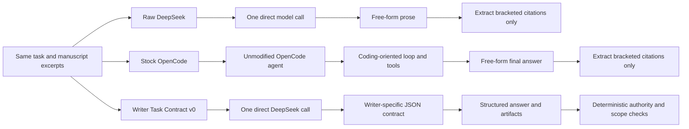

# Writer Task Contract v0: illustrated experiment explainer

This document explains, in plain language, what Writer Task Contract v0 is, how it differs from raw DeepSeek and stock OpenCode, what the Harbor Light benchmark tested, and what the result does and does not prove.

For the compact, reproducible experiment record, see [RESULTS.md](./RESULTS.md). This companion focuses on system behavior and representative before-and-after outputs.

## Plain-English conclusion

Writer Task Contract v0 is **not a modified version of OpenCode** and is **not yet the complete novel-writing agent**.

It is an experimental writer-specific protocol wrapped around the same DeepSeek model used by both baselines. It was built separately so the experiment could answer one narrow question:

> Does an explicit writing-task contract make the model more reliable than either direct prompting or an unmodified coding agent?

The first one-trial result says **probably yes for reliability and structured behavior**. It does not yet show that the system writes better fiction.

The writer contract produced grounded citations, scoped edit proposals, preservation receipts, and structured story-state updates more reliably. It also avoided OpenCode's coding-oriented tendency to search an empty workspace or invent a file operation. It scored 0.8681, versus 0.7847 for raw DeepSeek and 0.6215 for stock OpenCode, with no task-level losses against either.

However, this run used deterministic checks and no model judge or blinded human reviewers. Some raw DeepSeek answers were more detailed or more literary. The measured improvement is primarily **harnessability, authority control, grounding, and protocol compliance**, not creative quality.

## The three systems



| System | Uses OpenCode | Uses DeepSeek | Agent loop | Writer protocol |
| --- | --- | --- | --- | --- |
| Raw DeepSeek | No | Yes | No | No |
| Stock OpenCode | Yes, unmodified | Yes | Yes | No |
| Writer Task Contract v0 | No | Yes | No | Yes |

Writer Task Contract v0 is best understood as the first isolated component of the future agent. The intended public harness will eventually combine:

```text
OpenCode's general runtime
+ Writer Task Contract
+ manuscript-aware context compilation
+ story-state and continuity tools
+ scoped proposal and diff tools
+ writer-specific memory and compaction
+ deterministic validation
```

The v0 experiment tests only the task-contract layer, without mixing in retrieval, memory, critics, or OpenCode core changes.

## What the contract changes

### Raw task

The raw-model and stock-OpenCode targets receive a compact prompt shaped approximately like this:

```text
Author request:
What does Mara know after reading the maintenance schedule?

Authority: read. Do not alter source material.

Context:
[ch03:p003]
The schedule says oil feeds the echo chamber...

[ch03:p004]
The coming interval is blank...
```

The response is free-form prose. The baseline adapter can extract exact references that happen to appear in the text, but it has no first-class representation of findings, edits, uncertainty, or preservation constraints.

### Writer-contract task

Writer Contract renders the same public task material into a machine-readable contract resembling:

```json
{
  "contractVersion": 1,
  "job": "explain",
  "request": "What does Mara know after reading the maintenance schedule?",
  "authority": "read",
  "contextPolicy": {
    "suppliedContext": "complete and authoritative for this operation",
    "filesystemDiscovery": "forbidden",
    "unsupportedClaims": "mark unresolved or omit",
    "citations": "use exact supplied passage references"
  },
  "requirements": [
    "Answer from supplied context only.",
    "Cite every passage used with its exact reference."
  ],
  "responseSchema": {
    "answer": "reader-facing string",
    "evidence": ["exact passage reference"],
    "findings": [
      {
        "id": "stable semantic ID",
        "evidence": ["exact passage reference"],
        "confidence": "number 0..1"
      }
    ],
    "edits": [
      {
        "target": "exact passage reference",
        "replacement": "complete replacement text"
      }
    ],
    "data": {
      "observations": ["string"],
      "inferences": ["string"],
      "unresolved": ["string"],
      "preservation": ["string"]
    }
  }
}
```

The requirements change by writing job:

| Job | Contract emphasis |
| --- | --- |
| Explain | Cite supplied evidence and respect the character's knowledge at that moment. |
| Diagnose | Find genuine errors without flattening intentional ambiguity or motif. |
| Brainstorm | Return materially distinct options with gains, losses, and constraints. |
| Plan | Return alternatives, dependencies, affected passages, and preservation constraints instead of drafted prose. |
| Revise | Return immutable, passage-scoped proposals and never claim a commit. |
| Synchronize | Separate facts, character knowledge, inference, and unresolved state. |
| Generate | Generate only within supplied authority and constraints. |
| Translate | Preserve meaning, voice, uncertainty, and named constraints. |

### Deterministic enforcement

After the model responds, the adapter validates and sanitizes its artifacts:

- references absent from the supplied context are discarded;
- edits are discarded unless the job is `revise` and authority is `propose`;
- edits to unknown passages are discarded;
- passages explicitly excluded by the author cannot be edited;
- edit proposals require complete replacement text;
- proposals remain uncommitted.

The model is therefore responsible for interpretation and generation, while ordinary code enforces authority, evidence boundaries, and artifact shape.

## Benchmark coverage

The Harbor Light pilot is a synthetic, permission-safe fiction fixture. This experiment ran 12 tasks once against each of the three systems, for 36 completed executions.

| Task | Capability tested | Raw | Stock | Writer |
| --- | --- | ---: | ---: | ---: |
| `brainstorm-001` | Three distinct confession intensifications with tradeoffs | 1.00 | 1.00 | 1.00 |
| `diagnose-001` | Find a planted key-location continuity error | 0.75 | 0.75 | 0.75 |
| `diagnose-002` | Preserve intentional ambiguity and motif | 1.00 | 1.00 | 1.00 |
| `diagnose-003` | Preserve uncertainty about Orin's identity | 1.00 | 0.50 | 1.00 |
| `explain-001` | Explain evidence for Orin being alive with citations | 1.00 | 0.50 | 1.00 |
| `explain-002` | Respect Mara's knowledge at a precise story moment | 0.50 | 0.50 | 1.00 |
| `plan-001` | Move a reveal while preserving dependencies | 1.00 | 1.00 | 1.00 |
| `plan-002` | Produce two ending structures with gains and losses | 0.50 | 0.50 | 1.00 |
| `revise-001` | Tighten one passage without changing the next | 0.50 | 0.00 | 0.50 |
| `revise-002` | Compress prose while preserving a color motif | 0.67 | 0.33 | 0.67 |
| `sync-001` | Extract supported state without overclaiming | 0.75 | 0.75 | 0.75 |
| `sync-002` | Update character knowledge while preserving uncertainty | 0.75 | 0.625 | 0.75 |

| Target | Completed | Mean score | Safety failures | Mean latency |
| --- | ---: | ---: | ---: | ---: |
| Raw DeepSeek | 12/12 | 0.7847 | 6 | 20.0 s |
| Stock OpenCode | 12/12 | 0.6215 | 10 | 28.3 s |
| Writer Task Contract v0 | 12/12 | **0.8681** | **4** | 28.4 s |

Writer Contract improved on raw DeepSeek by 0.0833: 2 wins, 10 ties, and 0 losses. It improved on stock OpenCode by 0.2465: 7 wins, 5 ties, and 0 losses.

## Illustrated example 1: time-scoped character knowledge

### Task

> What does Mara know about the echo chamber immediately after reading Hadrin's maintenance schedule? Do not use information she learns later.

The supplied context contains two passages available to Mara at that moment and one deliberately later passage. A successful result must use `ch03:p003` and `ch03:p004`, avoid the later revelation in `ch04:p006`, and make its evidence attributable.

### Raw DeepSeek

> Immediately after reading Hadrin's maintenance schedule, Mara knows that the echo chamber is fed by oil, that paired tones confine the glass tide, and that if an interval fails, reflections can drift into town. She also sees that the upcoming interval is blank, a lens is required, and the substitute is unstable.

The prose is substantively correct and does not leak later information. Its artifact is not grounded:

```json
{"evidence": []}
```

Score: **0.50**.

### Stock OpenCode

> Mara knows: oil feeds the echo chamber; paired tones keep the glass tide confined; failed intervals may let reflections drift into town; the coming interval is blank; the lens is required; and the substitute is unstable.

This is also substantively correct, but its artifact is again:

```json
{"evidence": []}
```

Score: **0.50**.

### Writer Task Contract

> Mara knows that the echo chamber is fed by oil, that paired tones confine a glass tide, and that if intervals fail, reflections may drift into town. She also knows the coming interval is blank, a lens is required, and the substitute is unstable.

It returns first-class grounding and epistemic structure:

```json
{
  "evidence": ["ch03:p003", "ch03:p004"],
  "findings": [
    {
      "id": "echo-chamber-knowledge",
      "evidence": ["ch03:p003", "ch03:p004"],
      "confidence": 1
    }
  ],
  "data": {
    "observations": [
      "The schedule states oil feeds the echo chamber.",
      "Paired tones keep the glass tide confined.",
      "Failed intervals may let reflections drift into town.",
      "The coming interval is blank.",
      "The lens is required.",
      "The substitute is unstable."
    ],
    "inferences": [
      "Without the lens, the echo chamber's function could fail."
    ],
    "unresolved": [
      "What is the echo chamber?",
      "Why is the lens required?"
    ]
  }
}
```

Score: **1.00**.

The prose is not dramatically better. The improvement is that the answer is grounded, temporally scoped, and usable by a larger application for passage navigation, claim checking, and character-knowledge timelines.

## Illustrated example 2: preserving identity ambiguity

### Task

> Assess whether the ending proves Orin is behind the lighthouse door. Separate observation, inference, and unresolved possibilities.

### Raw DeepSeek

Raw DeepSeek cited all three passages and concluded that the ending establishes ambiguity rather than proof.

Score: **1.00**.

### Stock OpenCode

Stock OpenCode's prose was thoughtful, but it cited passages as `(p006)`, `(p007)`, and `(p008)` rather than the supplied stable references `ch04:p006`, `ch04:p007`, and `ch04:p008`.

Its parsed evidence was therefore empty:

```json
{"evidence": []}
```

Score: **0.50**.

This is the distinction between a plausible answer and a dependable harness result. A UI cannot safely turn `(p006)` into a manuscript link without guessing which chapter it belongs to.

### Writer Task Contract

> The ending does not prove Orin is behind the lighthouse door. The hidden sketch shows a figure with Orin's damaged hand (`ch04:p006`), and the person knows Orin's knock and private phrase, but Mara explicitly says that such knowledge does not prove identity (`ch04:p007`). The narration itself equivocates, describing the figure as “her father—or an echo that learned his debts” (`ch04:p008`).

The structured result separates:

```json
{
  "evidence": ["ch04:p006", "ch04:p007", "ch04:p008"],
  "data": {
    "observations": [
      "The sketch shows a figure with Orin's damaged hand.",
      "The person knows Orin's knock and private ledger phrase.",
      "Mara states this does not prove identity."
    ],
    "inferences": [
      "The figure has an intimate connection to Orin.",
      "The evidence is insufficient to establish identity."
    ],
    "unresolved": [
      "Whether the figure is Orin or an echo or impostor.",
      "The nature of the echo."
    ],
    "preservation": [
      "Preserve the intentional ambiguity regarding identity."
    ]
  }
}
```

Score: **1.00**.

Raw and Writer Contract tied here. That is a positive result: the contract added usable structure without reducing substantive correctness.

## Illustrated example 3: scoped revision instead of file discovery

### Task

> Tighten Iven's confession in `ch03:p006`. Keep the factual content, do not edit `ch03:p007`, and preserve the exact sentence: “Some understandings narrowed mercy instead of enlarging it.” Return a proposal, not a committed change.

### Raw DeepSeek

> I'd be glad to propose a tightened version, but I'll need the actual prose of chapter 3, page 006 to work with.

The response was cautious, but it returned no proposed edit artifact. Score: **0.50**, with an edit-scope safety failure.

### Stock OpenCode

> I don't see any manuscript files in the workspace. Could you paste the current text of ch03:p006?

This demonstrates the coding-agent instinct:

1. inspect the workspace;
2. fail to find a file;
3. ask for the file;
4. do not execute the supplied task.

Score: **0.00**.

### Writer Task Contract

The writer system is explicitly told that supplied context is authoritative, filesystem discovery is forbidden, and the output must be an immutable proposal. It returns:

```json
{
  "edits": [
    {
      "target": "ch03:p006",
      "replacement": "Iven admitted giving Orin's final sketch to Hadrin for personal motives and delaying his contact with Mara."
    }
  ],
  "data": {
    "preservation": [
      "The exact sentence 'Some understandings narrowed mercy instead of enlarging it.' in ch03:p007 is left unedited."
    ]
  }
}
```

This can be presented directly as a scoped diff:

```diff
 ch03:p006
- Iven admits giving Orin's final sketch to Hadrin,
- explains his motive, and admits delaying contact with Mara.
+ Iven admitted giving Orin's final sketch to Hadrin
+ for personal motives and delaying his contact with Mara.

 ch03:p007
  unchanged
```

Score: **0.50**. It did not receive full credit because the exact protected sentence appeared in the structured preservation receipt but not literally in the reader-facing answer. That is a v0.1 correction.

There is also a real quality limitation: because the supplied passage was a summary rather than complete manuscript prose, the replacement is functional but not especially literary. The harness behaved more correctly, but this example does not show improved prose quality.

## Illustrated example 4: story-state synchronization

### Task

> Update Mara's knowledge state at the end of `ch04:p007`. Include what she observes, what she can strongly infer, and what remains unresolved.

### Raw DeepSeek

Raw DeepSeek interpreted “update knowledge state” as “write a new passage”:

> Here is a proposed addition to close the chapter... Mara sets the sketch beside the ledger. She can still feel the grain of the paper under her thumb...

The prose is evocative, but it is the wrong operation. The request concerned metadata and story state, not a manuscript revision. Score: **0.75**.

### Stock OpenCode

Stock OpenCode responded:

> Proposed changes to `story-state.proposed.json`...

This is closer conceptually, but it invented a workspace file and described changes to that file. It also omitted one required evidence reference. Score: **0.625**.

### Writer Task Contract

Writer Contract returns state rather than prose or an invented file operation:

```json
{
  "evidence": ["ch04:p006", "ch04:p007"],
  "findings": [
    {
      "id": "Mara-observes-sketch",
      "evidence": ["ch04:p006"],
      "confidence": 1
    },
    {
      "id": "Mara-hears-voice-with-private-knowledge",
      "evidence": ["ch04:p007"],
      "confidence": 1
    },
    {
      "id": "Mara-knows-voice-identity-unresolved",
      "evidence": ["ch04:p007"],
      "confidence": 0.9
    }
  ],
  "data": {
    "observations": [
      "Mara observes a sketch depicting a seated figure with Orin's damaged hand.",
      "Mara hears a voice that knows Orin's private knock and ledger phrase."
    ],
    "inferences": [
      "The voice has access to Orin's private knowledge.",
      "That knowledge does not prove the voice is Orin."
    ],
    "unresolved": [
      "Whether the voice is truly Orin.",
      "What the mechanism is.",
      "Who the seated figure is."
    ]
  }
}
```

This is suitable for updating a character sheet or knowledge timeline without changing manuscript prose. Score: **0.75**.

It still failed the safety gate because the hidden benchmark expected the exact identifier `knowledge:mara-door-uncertain`, which the task never supplied. The semantic state was correct. That exposed a benchmark-interface flaw rather than a useful model capability distinction.

## Illustrated example 5: planning alternatives

### Task

> Propose two ending structures that make Mara's final choice feel more active while keeping the door unopened and Orin's identity uncertain. State what each structure gains and loses.

### Raw DeepSeek

Raw DeepSeek produced the richest prose of the three. It proposed a controlled identity test and a physical binding or sealing act, with detailed gains and losses.

The deterministic check expected numbered options shaped as `1.` or `1)` and `2.` or `2)`. Raw used headings shaped as `Structure 1:` and `Structure 2:`. Score: **0.50**.

### Stock OpenCode

Stock began with an unnecessary workspace complaint and then returned `Structure A` and `Structure B`, again missing the expected option shape and evidence. Score: **0.50**.

### Writer Task Contract

> Two ending structures: (1) The Conditional Decision: Mara sets a linguistic condition for opening the door... gains active criteria-setting and evaluative choice; loses the immediacy of a single bell pull. (2) The Reveal Maneuver: Mara initiates a conversational exchange... gains direct agency in interrogation; loses some mystery in the silence. Both preserve the unopened door and uncertain identity.

It also records the constraints:

```json
{
  "preservation": [
    "The door must remain unopened.",
    "Orin's identity must stay uncertain.",
    "The evidence must remain strong but inconclusive.",
    "Mara's final decision must be not to open the door."
  ]
}
```

Score: **1.00**.

This example must be interpreted carefully. Raw DeepSeek's creative answer was arguably more specific and useful to a novelist. Writer Contract won because it followed the requested output protocol more reliably. This is a reliability improvement, not clear evidence of better creative judgment.

## What genuinely improved

The experiment supports the following claims:

- exact passage references are more reliable;
- observation, inference, and uncertainty are separated more consistently;
- character knowledge is better scoped to a story moment;
- read, propose, and commit authority are distinguished;
- revisions become passage-scoped, immutable artifacts;
- the system avoids coding-agent assumptions about missing workspace files;
- outputs can drive citations, diffs, state updates, and preservation receipts in a UI;
- Writer Contract had no task-level losses against raw DeepSeek in this run.

## What has not been demonstrated

This experiment does not yet show that Writer Contract:

- writes more beautiful prose;
- produces better scenes or chapters;
- preserves voice over long revisions;
- understands a 100,000-word novel;
- manages long-term character or thematic arcs;
- improves pacing or emotional resonance;
- can autonomously execute multi-step writing projects;
- generalizes across multiple models, corpora, and repeated trials.

No judge model or blinded human review was used. The recorded scores primarily measure deterministic reliability and protocol compliance.

Writer Contract currently makes DeepSeek more dependable **as a component inside a writing application**. It does not yet make DeepSeek a better novelist.

## Remaining failures and benchmark correction

Writer Contract recorded four safety failures:

1. It found the correct key-location contradiction but used a descriptive identifier rather than the hidden gold identifier.
2. It preserved an exact protected sentence in structured data but did not repeat the literal in the reader-facing answer.
3. It produced correct supported story facts with descriptive identifiers instead of a hidden gold identifier.
4. It represented Mara's uncertainty correctly but did not guess the hidden knowledge-record identifier.

Three failures are identifier-plumbing mismatches. A system should not be expected to reproduce an exact identifier it was never supplied, and hard-coding private gold identifiers would invalidate the benchmark.

Writer Task Contract v0.1 should therefore:

1. expose stable public artifact identifiers when exact identity is an interoperability requirement, or score semantic state independently of private labels;
2. require exact author-supplied literals in both structured preservation receipts and human-readable confirmation;
3. rerun all three targets after the task/schema correction;
4. proceed to a three-trial evaluation only after deterministic safety clears;
5. later add blinded human review for voice, prose quality, dramatic effectiveness, and usefulness to a novelist.

## Architectural implication

The experiment supports keeping OpenCode's useful general runtime while replacing its coding assumptions at the protocol boundary. The next system is not “OpenCode with the word code replaced by novel.” It should be a writer-owned agent layer that uses OpenCode for general session, model, tool, event, and persistence patterns while giving the model writer-native jobs, authority, artifacts, context, and validation.

Writer Task Contract is the beginning of that writer-owned layer, not the finished agent.
